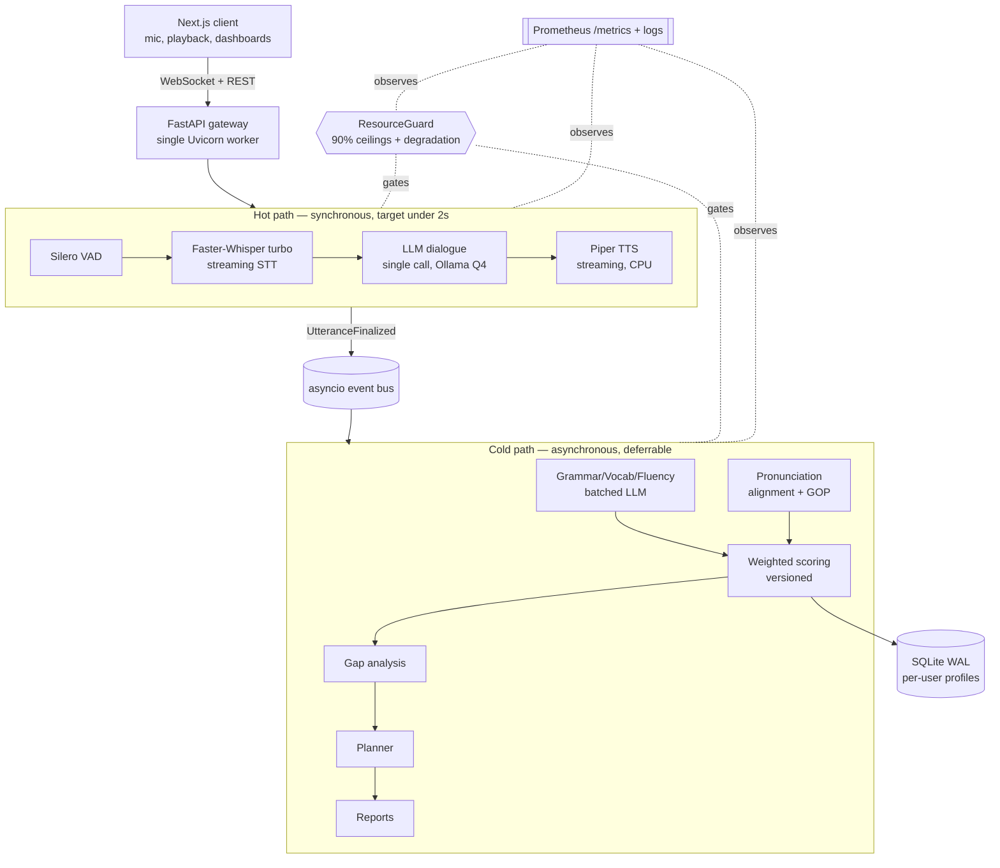

# Architecture — diagrams, sequence, contracts

Read before Phase 0 and Phase 3. The whole system is two paths sharing a resource
broker and a per-user store, connected by an in-process event bus.

## Component overview



## Hot-path sequence (one learner turn, <2s budget)

```mermaid
sequenceDiagram
  participant U as Learner
  participant WS as WS session
  participant RG as ResourceGuard
  participant STT as Faster-Whisper
  participant LLM as Dialogue LLM
  participant TTS as Piper
  U->>WS: audio frames
  WS->>RG: acquire(hot, stt)
  RG-->>WS: admit (or degraded params)
  WS->>STT: stream frames
  STT-->>WS: partial + final transcript
  WS->>RG: acquire(hot, llm)
  RG-->>WS: admit_degraded(max_tokens=...) if pressured
  WS->>LLM: prompt (single call)
  LLM-->>WS: streamed reply
  WS->>TTS: text chunks
  TTS-->>U: audio chunks (streamed)
  WS-)BUS: UtteranceFinalized(event)
  Note over WS,BUS: turn returns; evaluation happens later on cold path
```

## Event contracts

- `UtteranceFinalized { utterance_id, session_id, user_id, audio_path,
  transcript, stt_confidence, start_ms, end_ms }` — emitted by the hot path at
  turn end; consumed by the cold-path worker.
- `AssessmentReady { user_id, session_id, assessment_id }` — emitted after
  scoring; the dashboard/report layer subscribes to refresh progress.

Bus is asyncio pub/sub in-process. Subscribers must be non-blocking and
idempotent (cold jobs may be retried after deferral). No external broker.

## Why these boundaries

- **One Uvicorn worker**: multiple workers each load their own copy of the models
  → instant VRAM blowout on 8GB. Concurrency inside one worker via asyncio.
- **Event bus, not queue server**: one host, one process — a broker would add
  ops weight and storage for no benefit.
- **Guard as shared dependency**: a single, consistent view of the 90% budget
  across hot and cold paths; the one component that keeps the box alive.
- **Pronunciation off the LLM**: transcripts carry no acoustic detail; pronunciation
  must come from audio alignment/GOP.

## Deployment (no Docker)

Single host, single `uv`-managed environment (`uv venv` + `uv sync`; never pip).
Processes: (1) Uvicorn app run via `uv run uvicorn ...` (loads STT+LLM+TTS via
guard), (2) Ollama server for the LLM (its own keep-alive/unload), (3) optional
Prometheus + Grafana if the user wants dashboards. Frontend built statically and
served by the app or a lightweight static server. Everything binds to localhost.
Model files live on disk outside the repo; `setup_models.py` fetches them once,
logged, and the guard checks disk headroom before download.
